# C# on the GPU: When Performance Stops Being About Code (and Starts Being About Physics)

> *Or: how I stopped micro-optimising loops and learned to love the GPU.*

Full source code & benchmarks:
👉 **https://github.com/SolidRegardless/GpuStreamingDemo**

---

## 1. The Lie We All Tell Ourselves

At some point in every engineer’s career, we tell ourselves a comforting lie:

> “If I just optimise this loop a bit more, everything will be fine.”

So we:
- remove allocations
- unroll loops
- fight the branch predictor
- stare at flame graphs like they owe us money

And sometimes… it works.

Until it doesn’t.

Because there is a hard limit you eventually hit — and it isn’t your skill. It’s **physics**.

---

## 2. The Moment Performance Stops Being About Code

If your workload is:
- **large** (millions of elements)
- **predictable** (same operation repeated)
- **data-parallel** (each element independent)

Then the CPU is no longer your friend.

Not because it’s slow — CPUs are incredible — but because they are optimised for:
- latency
- control flow
- branchy logic

Not for chewing through gigabytes of identical maths.

That’s not a programming problem.

That’s a *hardware mismatch*.

---

## 3. The Goal of This Experiment

I wanted to answer a very simple question:

> **Can modern C# orchestrate real GPU acceleration, cleanly, portably, and credibly?**

Not a toy example.
Not a CUDA-C microbenchmark.
Not a hand-waved blog post with suspicious numbers.

But:
- real memory transfers
- real kernels
- real timing
- real hardware

And numbers you can reproduce.

---

## 4. The Rules (No Cheating)

I imposed some strict rules on myself:

1. **Same algorithm** everywhere
2. **Same memory path** (host → device → host)
3. **Same batch size**
4. **Same codebase**
5. **Only the execution backend may change**

If the numbers improved, it had to be because the **execution model changed** — not because I gamed the benchmark.

---

## 5. High-Level Architecture

Here’s the mental model:


Key idea:

> **The CPU orchestrates. The GPU executes.**

The CPU stays responsive. The GPU does the heavy lifting.

---

## 6. Component Breakdown


This separation matters:
- pipeline logic stays testable
- compute logic stays focused
- hardware selection stays isolated

This is not “GPU code everywhere”.
It’s **GPU code where it belongs**.

---

## 7. The Kernel (Intentionally Boring)

The kernel is simple by design:

```csharp
public static void AffineTransform(
    Index1D index,
    ArrayView<float> x,
    ArrayView<float> y,
    float a,
    float b)
{
    if (index >= x.Length)
        return;

    y[index] = a * x[index] + b;
}
```

Why so boring?

Because boring kernels are *honest*.

If this shows massive speedups, it’s not because of clever maths — it’s because the **execution model changed**.

---

## 8. Execution Model (What Actually Happens)

```mermaid
sequenceDiagram
    participant CPU
    participant GPU

    CPU->>GPU: Copy batch (Host → Device)
    CPU->>GPU: Launch kernel
    GPU-->>GPU: Massive parallel execution
    GPU-->>CPU: Copy results (Device → Host)
```



No magic.
No zero-cost abstractions.
No fairy dust.

Just silicon doing what it was designed to do.

---

## 9. Cross-Platform Reality (No Marketing Lies)

This is where most blog posts start to quietly mumble.

Let’s be explicit.

### Source-level portability

✔ C# / .NET
✔ ILGPU abstraction
✔ Same codebase everywhere

### Backend availability

| Platform | CPU | CUDA | OpenCL |
|--------|-----|------|--------|
| Windows | ✅ | ✅ | ✅ |
| Linux | ✅ | ✅ | ✅ |
| macOS | ✅ | ❌ | ⚠️ Deprecated |

Key takeaway:

> **Execution is portable. Acceleration is hardware-dependent.**

Anything else would be dishonest.

---

## 10. Benchmark Methodology

I benchmarked:

- **Batch size:** 1,048,576 floats (~4 MB)
- **Warm-up iterations:** 5
- **Measured iterations:** 50

Metrics collected:
- average latency
- P95 latency
- throughput (elements/sec)

Warm-up matters:
- JIT compilation
- kernel compilation
- driver initialisation

If you skip warm-up, you’re lying to yourself.

---

## 11. The Results (Real Numbers)

```
Cpu      | Avg: 128.04 ms | P95: 148.84 ms | Throughput:   8.19 M elems/s
Cuda     | Avg:   1.26 ms | P95:   2.88 ms | Throughput: 832.33 M elems/s
OpenCL   | Avg:   1.09 ms | P95:   3.18 ms | Throughput: 959.19 M elems/s
```

Let that sink in.

---

## 12. Interpreting the Numbers (This Is the Important Bit)

### CPU
- ~128 ms per batch
- High tail latency
- Throughput measured in **single-digit millions**

### GPU
- ~1–3 ms per batch
- Tight latency distribution
- Throughput measured in **hundreds of millions**

This is not 10% faster.
This is not 2× faster.

This is **two orders of magnitude**.

---

## 13. “But My CPU Has 32 Cores!”

Yes.

And the GPU still wins.

Because:
- thousands of execution lanes
- memory coalescing
- predictable access patterns
- hardware designed for throughput

This isn’t about disrespecting CPUs.

It’s about using the right tool.

---

## 14. Why OpenCL Beat CUDA (And Why That’s OK)

People panic when they see this.

Don’t.

Possible reasons:
- simpler kernel
- driver scheduling differences
- queue behaviour

The **important result** is not which GPU backend won.

The important result is:

> **Offloading dwarfs backend choice.**

---

## 15. The Architectural Lesson

The biggest performance gain came from:

❌ clever code
❌ micro-optimisations
❌ fighting the compiler

✅ changing where the code runs

This is the lesson people miss.

---

## 16. What This Enables

This pattern applies directly to:

- financial simulations
- Monte-Carlo risk models
- signal processing
- image pipelines
- AI feature extraction
- scientific workloads

Anywhere data dominates branches.

---

## 17. What This Is *Not*

Let’s be clear:

❌ Not a synthetic CUDA demo
❌ Not vendor-locked
❌ Not a one-off benchmark

This is a **production-shaped system**.

---

## 18. Future Work (Because Of Course)

Natural next steps:

- double-buffered async overlap
- PCIe vs kernel timing breakdown
- batch size sweeps
- multi-GPU fan-out
- CSV / Markdown export

Each one will squeeze more performance — but none will match the first win.

---

## 19. The Real Takeaway

C# is not slow.

It’s honest.

If your algorithm is slow, it’s usually because it’s running on the wrong silicon.

---

## 20. Final Thought

> *At some point, performance tuning stops being about code and starts being about physics.*

Full source, architecture, and benchmarks:

👉 **https://github.com/SolidRegardless/GpuStreamingDemo**
